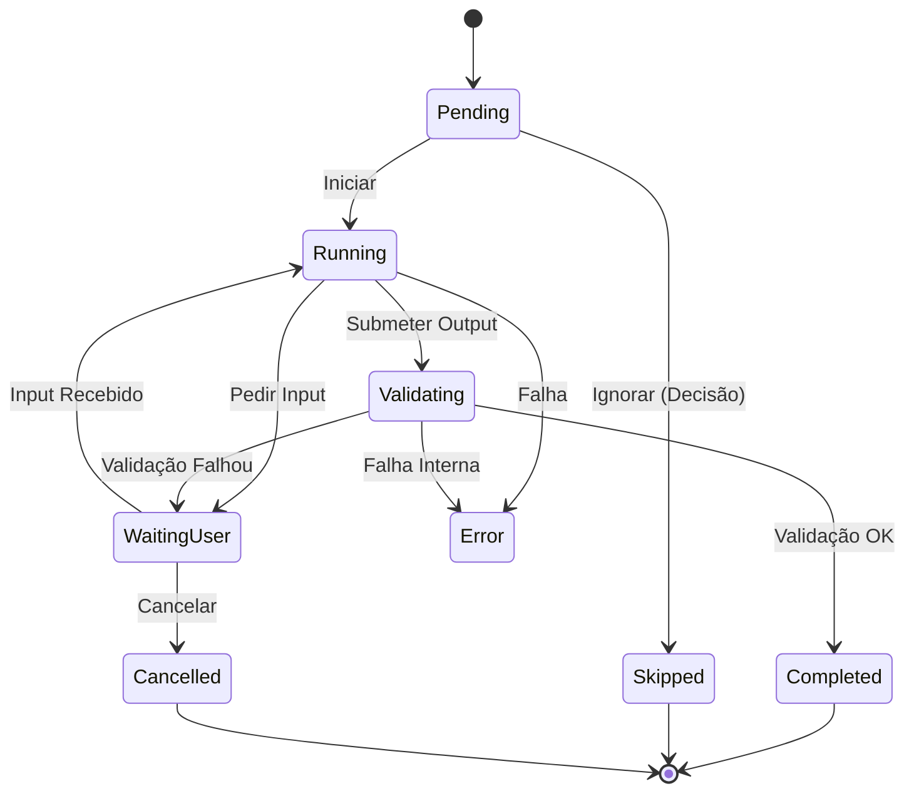

# RFC-003 — Protocol Runtime Specification

> **Versão:** 1.0
> **Status:** 🟡 DRAFT — aguarda revisão e aprovação
> **Dependência:** RFC-001 (Product Constitution) · RFC-002 (Knowledge Architecture)
> **Última atualização:** Julho de 2026
> **Autor:** Egas Lemos

---

## 1. Contexto e Motivação

A [RFC-001](RFC-001-Product-Constitution.md) definiu o **Research Protocol OS (RPOS)**, onde os protocolos são executados por um Kernel centralizado. No entanto, faltava definir a **mecânica exata** dessa execução. 

Para que o ResearchAI Hub funcione como um assistente metodológico resiliente, não pode ser um mero renderizador de texto ou uma lista de tarefas (checklist) estática. O sistema deve gerir fluxos de trabalho longos, reter progresso de forma persistente e lidar com desvios na jornada do utilizador.

A **RFC-003** define formalmente como o Runtime Engine executa os protocolos, estabelecendo o princípio de **Máquina de Estados (State Machine)**.

---

## 2. Princípio Fundacional: Protocolo como Máquina de Estados

> O Runtime **nunca** executa um protocolo como uma lista linear de passos. O Runtime interpreta e avalia **estados**.

Cada protocolo é uma Máquina de Estados Finita (Finite State Machine). A execução avança não por "passar para a página seguinte", mas sim pela transição de um estado válido para outro, despoletada por eventos concretos.

Isto permite que:
1. Qualquer protocolo possa ser pausado e retomado.
2. A validação de outputs bloqueie a progressão de forma segura.
3. Decisões do utilizador ramifiquem a jornada de forma determinística.

---

## 3. Elementos do Runtime

O Runtime Engine interpreta cinco componentes fundamentais durante a execução:

| Componente     | Função no Runtime                                                            |
|----------------|-------------------------------------------------------------------------------|
| **State**      | O estado actual do Step (ex: `Running`, `WaitingUser`).                      |
| **Transitions**| As regras que definem como passar de um estado para o próximo (ex: `Pending -> Running`). |
| **Events**     | Ações explícitas (humanas ou do sistema) que forçam a avaliação de uma Transição. |
| **Validation** | O conjunto de regras de negócio (Critérios) avaliadas antes da transição para `Completed`. |
| **Outputs**    | Os artefactos (texto, ficheiros, JSON) gerados num Step, preservados no State da Sessão. |

---

## 4. Ciclo de Vida de um Step

Cada etapa (`Step`) do protocolo obedece a um ciclo de vida rigoroso, sendo obrigado a assumir um dos seguintes **8 Estados**:

### 4.1 Estados Obrigatórios

1. **`Pending`**: O Step está bloqueado, aguardando a conclusão de etapas anteriores ou o início explícito do protocolo.
2. **`Running`**: O Step está activo, executando lógica interna ou orquestrando integrações sistémicas invisíveis ao utilizador.
3. **`WaitingUser`**: O Step está em pausa, requerendo input explícito, revisão ou decisão por parte do utilizador.
4. **`Validating`**: O output gerado foi submetido e está a ser avaliado face aos critérios de qualidade/validação.
5. **`Completed`**: O Step concluiu com sucesso e gerou um Output validado. Desbloqueia dependências.
6. **`Skipped`**: O Step foi ignorado intencionalmente (por norma através de um `Decision Node`).
7. **`Cancelled`**: O processo foi cancelado antes de terminar (por intenção do utilizador ou erro grave).
8. **`Error`**: O Step encontrou um bloqueio ou falha (ex: timeout de rede) e requer resolução.

### 4.2 Matriz de Transições de Estado

O diagrama seguinte ilustra as transições válidas no ciclo de vida de um Step.



**Exemplo Prático de Fluxo:**
```
Pending → (utilizador clica 'Iniciar') 
Running → (interface pede preenchimento da pergunta de investigação) 
WaitingUser → (utilizador clica 'Submeter') 
Running → (o sistema encaminha para validação) 
Validating → (validação passa com sucesso) 
Completed
```

---

## 5. Decision Nodes (Ramificação)

Nem todos os protocolos são lineares. O Runtime suporta **Decision Nodes** (Nós de Decisão), representados por etapas que avaliam variáveis ou inputs e alteram o estado de outros Steps futuros.

**Exemplo de Execução de um Decision Node:**
- **Pergunta**: *"Existe literatura suficiente após a pesquisa inicial?"*
- **Transição A (Sim)**: O Step actual vai para `Completed` e o Step `Refinar Pesquisa` é marcado como `Skipped`. O fluxo avança para `Análise Temática`.
- **Transição B (Não)**: O Step actual vai para `Completed`, o Step `Refinar Pesquisa` passa de `Pending` para `Running`.

---

## 6. Eventos Internos do Runtime

Para garantir a total rastreabilidade, todas as mudanças de estado são provocadas por **Eventos**. O EventBus (Camada 1, RFC-001) emite e regista estes eventos:

| Evento                 | Acionador / Significado                                                       |
|------------------------|-------------------------------------------------------------------------------|
| `UserInput`            | O utilizador introduziu dados (texto, selecção) num formulário/interface.     |
| `ToolExecuted`         | O utilizador indicou que utilizou a ferramenta (ex: abriu o ChatGPT).         |
| `PromptGenerated`      | O sistema processou o `PromptEngine` e exibiu o prompt final com variáveis.   |
| `ValidationPassed`     | O mecanismo de validação (manual ou automático) confirmou o critério do Step. |
| `ValidationFailed`     | O output não atendeu aos requisitos (redireciona para correção/WaitingUser).  |
| `Timeout`              | Limite de tempo excedido a aguardar um callback de sistema externo.           |
| `Cancel`               | O utilizador interrompeu explicitamente o protocolo em andamento.             |

---

## 7. Persistência e Interrupção (Resume/Suspend)

O objectivo supremo desta arquitectura baseada em Estados é permitir que **qualquer protocolo seja interrompido e retomado posteriormente**, mesmo numa versão totalmente estática (MVP sem base de dados backend).

### 7.1 Mecanismo de Serialização
Como o Runtime é impulsionado apenas pelo estado atual, a totalidade da execução pode ser preservada. 

A cada emissão de um evento que altere o Estado de um Step, o Runtime exporta o **StateSnapshot**.

O `StateSnapshot` contém:
1. ID do Protocolo.
2. Dicionário de Steps com os seus Estados (ex: `{"STP-001": "Completed", "STP-002": "WaitingUser"}`).
3. Outputs armazenados (`{"STP-001_output": "Pergunta de Investigação X"}`).

No MVP estático, este `StateSnapshot` é armazenado no **LocalStorage** do browser. Quando o utilizador regressa, o Runtime hidrata a Máquina de Estados e restabelece a UI exactamente no ponto da interrupção.

---

## 8. Critérios de Aprovação

Esta RFC considera-se aprovada quando:

- [ ] O modelo de Máquina de Estados for aceite como base do Runtime.
- [ ] A lista de 8 Estados do ciclo de vida for validada.
- [ ] O fluxo de transições (Diagrama/Matriz) for aprovado.
- [ ] O mecanismo de nós de decisão (Decision Nodes) for aceite.
- [ ] O catálogo inicial de Eventos for validado.
- [ ] O modelo de serialização (StateSnapshot) para resumir protocolos for aprovado.

---

> *"No ResearchAI Hub, a investigação não avança porque se mudou de página, avança porque se cumpriu um estado. O método científico exige previsibilidade."*
