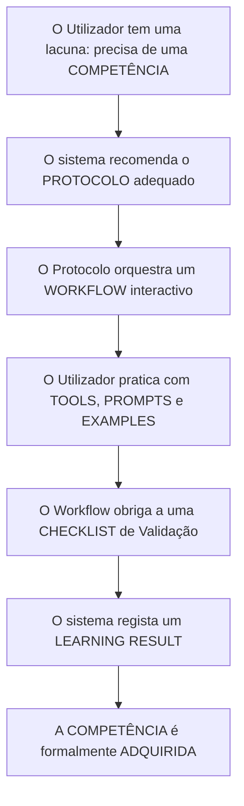

# RFC-004 — ResearchAI Hub Domain Model

> **Versão:** 1.0
> **Status:** 🟡 DRAFT — aguarda revisão e aprovação
> **Dependência:** RFC-000 (Product Vision)
> **Última atualização:** Julho de 2026
> **Autor:** Egas Lemos

---

## 1. Contexto e Motivação

As RFCs anteriores (001, 002, 003) trataram a arquitectura tecnológica e o modelo de execução (Runtime, Knowledge Objects, State Machines). Contudo, a tecnologia deve estar sempre subordinada ao negócio. 

A **RFC-004** define estritamente o modelo de negócio da plataforma. O objectivo é estabelecer um vocabulário comum (Domain-Driven Design - DDD) sem referência a bases de dados, frontend ou código. Define-se *o que* o ResearchAI Hub é do ponto de vista do seu valor.

---

## 2. Princípio Fundacional: A Centralidade da Competência

O ResearchAI Hub é uma **Plataforma de Desenvolvimento de Competências Científicas Assistidas por Inteligência Artificial**.

> **Os Protocolos NÃO são o produto.**
> Os Protocolos são mecanismos pedagógicos. O verdadeiro objectivo e o produto final que a plataforma entrega é o desenvolvimento e a aquisição de **Competências**.

O utilizador não "consome protocolos"; o utilizador "adquire competências científicas estruturadas".

---

## 3. Business Objects (O Domínio)

O Domínio de Negócio é composto pelos seguintes *Business Objects* e as suas definições semânticas.

### 3.1 Entidades Nucleares da Aprendizagem

#### Competency (Competência)
- **Objetivo**: Representar uma habilidade científica específica e mensurável que o utilizador deve adquirir.
- **Descrição**: O alvo final da plataforma (ex: "Capacidade de desenhar uma estratégia de pesquisa booleana").
- **Responsabilidades**: Validar se o utilizador domina um conceito.
- **Relações**: É avaliada pelos `Learning Results` e suportada por `Protocols`.
- **Estado/Ciclo de Vida**: Descoberta → Em Progresso → Adquirida.

#### Learning Path (Trilha de Aprendizagem)
- **Objetivo**: Guiar o investigador a longo prazo através de múltiplos temas.
- **Descrição**: Um mapa estruturado que agrupa Programas, Cursos e Protocolos orientados a um perfil (ex: "Trilha para Doutorandos em Início de Tese").
- **Responsabilidades**: Organizar a evolução sequencial do utilizador a longo prazo.
- **Relações**: Contém `Programs` e `Courses`.
- **Estado/Ciclo de Vida**: Iniciada → Activa → Concluída.

#### Program (Programa)
- **Objetivo**: Certificar um conjunto macro de saberes.
- **Descrição**: Uma colecção oficial de cursos e workshops concebidos para formar um investigador numa macro-área (ex: "Programa de Investigação Assistida por IA").
- **Responsabilidades**: Emitir certificação ao utilizador.
- **Relações**: Agrupa múltiplos `Courses` e `Workshops`.
- **Estado/Ciclo de Vida**: Matriculado → Em Andamento → Aprovado.

#### Course (Curso)
- **Objetivo**: Ensinar teoria e prática de forma estruturada.
- **Descrição**: Uma unidade pedagógica composta por múltiplos módulos teóricos e práticos.
- **Responsabilidades**: Transmitir o enquadramento metodológico antes da aplicação prática.
- **Relações**: Contém `Modules`. Suporta-se em `Resources`.
- **Estado/Ciclo de Vida**: Não Iniciado → A decorrer → Finalizado.

#### Module (Módulo)
- **Objetivo**: Focar num tópico isolado dentro de um curso.
- **Descrição**: A unidade mínima de ensino sequencial (ex: "Fundamentos de Prompts").
- **Responsabilidades**: Delimitar a carga cognitiva de uma sessão de estudo.
- **Relações**: Pertence a um `Course`. Pode referenciar `Exercises`.
- **Estado/Ciclo de Vida**: Bloqueado → Desbloqueado → Concluído.

#### Workshop (Workshop)
- **Objetivo**: Resolver um problema muito específico e prático.
- **Descrição**: Uma sessão pedagógica intensiva, prática e curta, totalmente orientada para a ação.
- **Responsabilidades**: Entregar um resultado palpável e rápido (ex: "Workshop de configuração do Zotero").
- **Relações**: Utiliza `Protocols` e `Tools`.
- **Estado/Ciclo de Vida**: Disponível → Concluído.

### 3.2 Entidades de Execução Prática

#### Protocol (Protocolo)
- **Objetivo**: Garantir a reprodução correcta de uma técnica científica.
- **Descrição**: O veículo metodológico que guia a execução passo a passo de uma tarefa complexa.
- **Responsabilidades**: Garantir consistência, rigor e uso ético de IA.
- **Relações**: Orquestra um `Workflow`. Serve uma `Competency`.
- **Estado/Ciclo de Vida**: Seleccionado → Em Execução → Validado.

#### Workflow (Fluxo de Trabalho)
- **Objetivo**: Organizar a sequência lógica de ações.
- **Descrição**: O diagrama de passos obrigatórios, alternativos e de validação necessários para fechar o Protocolo.
- **Responsabilidades**: Controlar o que o utilizador pode fazer no momento presente.
- **Relações**: Pertence ao `Protocol`. Orquestra múltiplos `Exercises`, `Prompts` e `Tools`.
- **Estado/Ciclo de Vida**: Instanciado → Pausado / Activo → Finalizado.

#### Tool (Ferramenta)
- **Objetivo**: Acelerar ou executar uma função técnica.
- **Descrição**: Solução externa (software, LLM, base de dados) utilizada num passo do workflow.
- **Responsabilidades**: Executar o input (prompt) e devolver um output semântico.
- **Relações**: Agnosticismo (BYOT). Invocada pelo `Workflow`.
- **Estado/Ciclo de Vida**: Disponível → Configurada → Recomendada.

#### Prompt (Instrução)
- **Objetivo**: Comunicar com a IA de forma determinística e optimizada.
- **Descrição**: Matriz de instruções formatadas e testadas que evitam alucinações e garantem rigor científico.
- **Responsabilidades**: Parametrizar a Tool adequadamente.
- **Relações**: Executado numa `Tool`. Integrado num `Workflow`.
- **Estado/Ciclo de Vida**: Template → Preenchido (Instanciado) → Submetido.

#### Example (Exemplo)
- **Objetivo**: Fornecer um modelo mental claro do padrão de sucesso.
- **Descrição**: Uma demonstração real de como um input ou output deve ser estruturado.
- **Responsabilidades**: Calibrar as expectativas do utilizador.
- **Relações**: Associado a `Prompts`, `Protocols` e `Exercises`.
- **Estado/Ciclo de Vida**: Estático (apenas leitura).

#### Exercise (Exercício)
- **Objetivo**: Forçar a prática e a consolidação de conhecimentos.
- **Descrição**: Um desafio interactivo inserido num fluxo de aprendizagem.
- **Responsabilidades**: Avaliar o domínio do investigador num ponto isolado.
- **Relações**: Contido num `Module` ou `Workflow`.
- **Estado/Ciclo de Vida**: Por resolver → Em avaliação → Aprovado/Reprovado.

#### Checklist (Lista de Verificação)
- **Objetivo**: Prevenir falhas humanas e metodológicas.
- **Descrição**: O garante da qualidade antes da conclusão de um protocolo.
- **Responsabilidades**: Validar a completude.
- **Relações**: Encerra um `Protocol` ou `Module`.
- **Estado/Ciclo de Vida**: Por preencher → Em preenchimento → Validada.

### 3.3 Entidades de Avaliação e Registo

#### Learning Session (Sessão de Aprendizagem)
- **Objetivo**: Rastrear o esforço temporal e a continuidade do utilizador.
- **Descrição**: O período discreto em que o investigador esteve activo a desenvolver trabalho.
- **Responsabilidades**: Manter contexto caso a sessão seja interrompida (Suspend/Resume).
- **Relações**: Regista actividade sobre qualquer Business Object.
- **Estado/Ciclo de Vida**: Iniciada → Pausada → Encerrada.

#### Learning Result (Resultado de Aprendizagem)
- **Objetivo**: Comprovar e materializar o que foi alcançado.
- **Descrição**: O artefacto final (documento, análise, certificado) somado ao registo de aprovação sistémica.
- **Responsabilidades**: Provar de forma auditável que a competência foi alcançada.
- **Relações**: Confirma a `Competency`.
- **Estado/Ciclo de Vida**: Proposto → Avaliado → Registado.

#### Resource (Recurso)
- **Objetivo**: Suportar a aprendizagem com matéria auxiliar.
- **Descrição**: Livros, artigos, PDFs, vídeos, datasets.
- **Responsabilidades**: Aprofundar tópicos de forma assíncrona.
- **Relações**: Anexado a `Courses`, `Modules` ou `Workshops`.
- **Estado/Ciclo de Vida**: Disponível.

---

## 4. Fronteiras Arquitecturais (Bounded Contexts)

Para manter a separação de preocupações (Separation of Concerns), cada objecto pertence exclusivamente a um domínio arquitectural.

| Pertence ao **Domain (Negócio)** | Pertence ao **Runtime (Execução)** | Pertence ao **Frontend (UI)** |
|----------------------------------|------------------------------------|-------------------------------|
| Competency                       | StateMachine                       | Dashboard                     |
| Learning Path                    | EventBus                           | ProtocolViewer                |
| Program / Course / Module        | SessionManager                     | StepRenderer                  |
| Protocol (Conceito)              | ManifestParser                     | ProgressBars                  |
| Workshop                         | WorkflowExecutor                   | Checkbox Components           |
| Learning Result                  | StateSnapshot (Storage)            | Notifications                 |
| Competency                       | ToolAdapter                        | ToolCatalogs                  |

*Nota: O Domínio define "o que", o Runtime define "como processa", e o Frontend define "como se apresenta".*

---

## 5. O Ciclo de Evolução do Utilizador

O valor central da plataforma expressa-se através de um funil de conversão pedagógica. O fluxo não é de consumo passivo, mas de aquisição activa.

1. **Competência Alvo**: O investigador entra porque precisa de desenhar uma revisão sistemática.
2. **Protocolo**: A plataforma guia o investigador para o protocolo `LIT-SR-01`.
3. **Workflow**: O investigador executa as etapas metodológicas.
4. **Resultado**: O investigador termina o fluxo e submete o artefacto.
5. **Competência Adquirida**: A lacuna original foi resolvida e o utilizador cresceu cientificamente.

---

## 6. Critérios de Aprovação

Esta RFC considera-se aprovada quando:

- [ ] A redefinição de que "Os Protocolos não são o produto, mas sim mecanismos pedagógicos para Competências" for aceite.
- [ ] O dicionário de 16 Business Objects for validado.
- [ ] A separação entre Domínio, Runtime e Frontend for compreendida.
- [ ] O Ciclo de Evolução do Utilizador refletir a visão de negócio da plataforma.

---

> *"Um investigador usa o ResearchAI Hub não para ter o trabalho feito por uma IA, mas para ser melhor investigador enquanto faz o trabalho com IA."*
